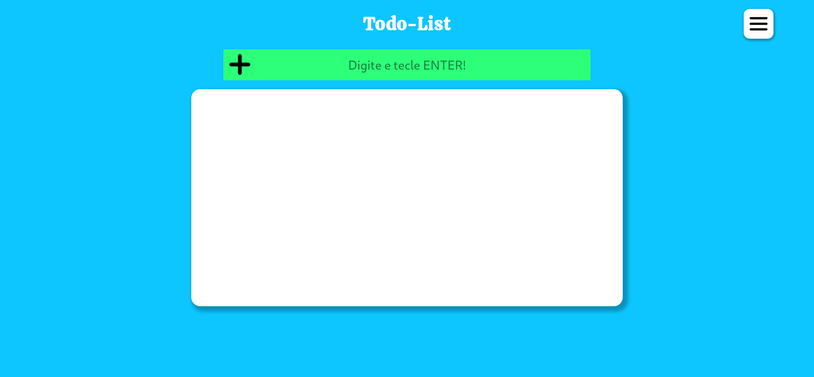

# ToDo-List-JS  
 - Fiz um pequeno projeto para testar meus conhecimentos básicos em JS, onde usei funções e eventos (EventListener) para manipular o conteúdo no DOM.  
 - O resultado foi muito bom mas pretendo refazer este projeto conforme meus estudos forem progredindo, o próximo passo seria inserir as tarefas em um JSON e salvar no localstorage ou DB utilizando lampp.  
 - Gostei bastante do layout e da paleta de cores que usei no projeto mas da próxima vez estudarei um pouco a ferramenta Figma para design de layouts e usarei para me ajudar a desenvolver mais rápido.  
## Funções:  
  - É possível inserir uma nova tarefa digitando no campo input e teclando enter.  
  - Ao clicar no item ele é marcado como concluído e então é possível excluí-lo.  
  - Caso tente excluir uma tarefa antes de marcar como concluído, um alerta aparece instruindo a forma correta de excluir o item.  
  - No menu existe a opção de alternar entre o tema claro e escuro.  
    